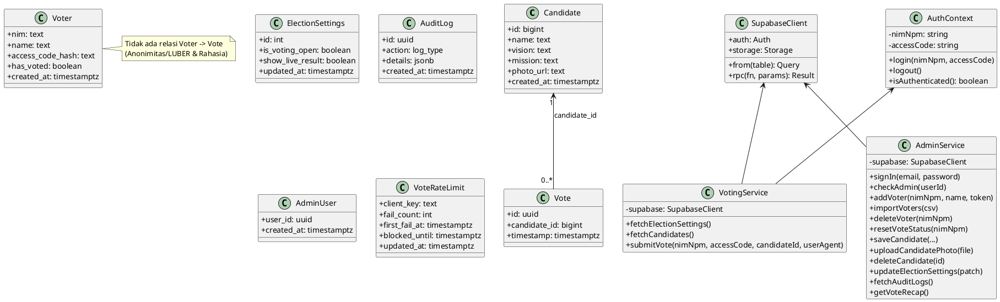
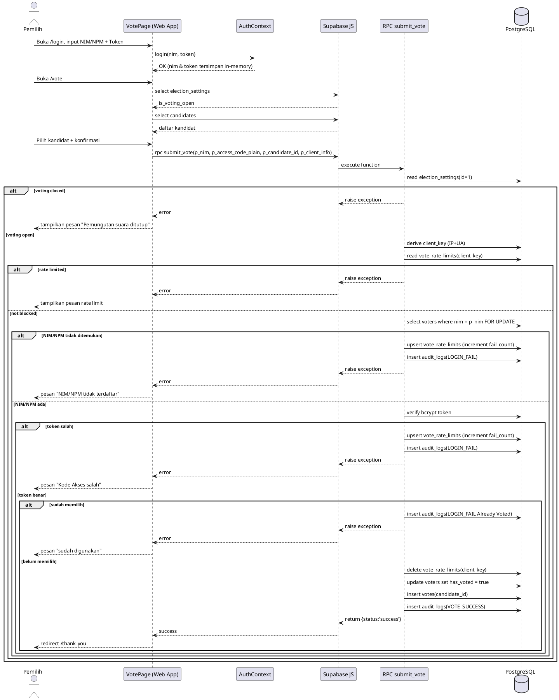

# Panduan Membuat UML – Project E-Voting Ketua BEM (Supabase + React)

Dokumen ini berisi **flow/panduan** untuk kamu menggambar 3 UML berdasarkan implementasi project:

1. **Use Case Diagram**
2. **Class Diagram**
3. **Sequence Diagram**

Tujuan dokumen ini adalah agar kamu bisa langsung menggambar UML di tools seperti **StarUML**, **draw.io**, atau **PlantUML/Mermaid**, dengan elemen yang **selaras dengan kode**.

---

## 0) Ringkasan Sistem (Sumber Elemen UML)

### A. Aktor (Real di sistem)

- **Pemilih** (user publik yang melakukan voting)
- **Panitia/Admin** (user terdaftar di Supabase Auth + dicatat di tabel `admin_users`)
- **Supabase** (sebagai platform backend: Auth, PostgREST/RPC, Storage)

### B. Modul / Halaman (Frontend)

**Public / Pemilih**

- `/` `HomePage` (lihat status pemilu + navigasi)
- `/login` `LoginPage` (input NIM/NPM + `accessCode` ke `AuthContext`)
- `/vote` `VotePage` (lihat kandidat + submit vote via RPC `submit_vote`)
- `/thank-you` `ThankYouPage` (auto logout + redirect)
- `/results` `ResultsPage` (rekap via RPC `get_vote_recap`)
- `/live` `LivePage` (quick count jika `show_live_result = true`)

**Admin**

- `/admin/login` `AdminLoginPage` (Supabase Auth: `signInWithPassword`)
- `/admin` `AdminLayout` (cek session + cek `admin_users`)
- `/admin/dashboard` `AdminDashboardPage` (kontrol settings + statistik + chart)
- `/admin/voters` `AdminVotersPage` (CRUD DPT + import/export + reset status)
- `/admin/candidates` `AdminCandidatesPage` (CRUD kandidat + upload foto Storage)
- `/admin/audit` `AdminAuditPage` (lihat audit log)

### C. Data & Backend (Database/RPC)

Tabel utama:

- `candidates`
- `voters`
- `votes` (**anonim**, tidak ada relasi ke `voters`)
- `audit_logs`
- `election_settings`
- `admin_users`
- `vote_rate_limits` (rate limit brute force)

RPC utama:

- `admin_add_voter(p_nim, p_name, p_access_code_plain)`
- `submit_vote(p_nim, p_access_code_plain, p_candidate_id, p_client_info)`
- `get_vote_recap()`

---

# 1) UML Use Case Diagram

## 1.1 Flow Membuat Use Case Diagram

### Langkah 1 — Tentukan boundary sistem

Nama boundary contoh:

- **Sistem E-Voting Ketua BEM (Web App + Supabase)**

> Kalau kamu ingin lebih akademis, kamu boleh pisahkan jadi 2 boundary: **Frontend Web** dan **Backend Supabase**, tapi untuk skripsi biasanya cukup 1 boundary.

### Langkah 2 — Tentukan aktor

Gunakan aktor berikut:

- **Pemilih**
- **Panitia/Admin**
- *(opsional)* **Supabase Auth/Storage** sebagai aktor eksternal (jika kamu ingin menonjolkan integrasi BaaS)

### Langkah 3 — Daftar use case per aktor

**Pemilih**

- Melihat informasi & status pemilu
- Login pemilih (input NIM/NPM + Kode Akses)
- Melihat daftar kandidat
- Melihat detail kandidat
- Memilih kandidat
- Mengirim suara (submit vote)
- Melihat rekap hasil (`/results`)
- Melihat live quick count (`/live`) *(tergantung setting)*
- Logout/akhiri sesi

**Panitia/Admin**

- Login admin (Supabase Auth)
- Verifikasi akses admin (cek tabel `admin_users`)
- Kelola kandidat (CRUD)
- Upload foto kandidat (Supabase Storage)
- Kelola DPT/pemilih (CRUD)
- Import DPT (CSV → generate token → insert via `admin_add_voter`)
- Export rekap DPT (CSV)
- Reset status memilih pemilih (update `voters.has_voted`)
- Kontrol pemilu (buka/tutup voting, tampilkan/sembunyikan live result)
- Melihat audit log
- Melihat dashboard statistik

### Langkah 4 — Buat relasi include/extend (biar UML kamu “bercerita”)

Contoh yang cocok untuk project ini:

- **Import DPT** `<<include>>` **Generate Token**
- **Kelola kandidat** `<<include>>` **Upload foto kandidat** *(opsional, karena foto bisa kosong)*
- **Mengirim suara** `<<include>>` **Validasi voting dibuka**
- **Mengirim suara** `<<include>>` **Validasi NIM/NPM & Token**
- **Mengirim suara** `<<include>>` **Cegah double vote**
- **Mengirim suara** `<<include>>` **Simpan suara anonim**
- **Mengirim suara** `<<include>>` **Tulis audit log**
- **Mengirim suara** `<<extend>>` **Rate limit brute force** *(jalan hanya di kondisi tertentu: NIM/NPM tidak ada / token salah)*

### Langkah 5 — Tata letak

- Letakkan **Pemilih** di kiri, use case pemilih di dalam boundary.
- Letakkan **Admin** di kanan, use case admin di dalam boundary.
- Use case yang “shared” (misal rekap) bisa diletakkan di tengah.

## 1.2 Template PlantUML (opsional, bisa kamu copy)

> Ini template siap pakai. Kalau kamu tidak mau “auto-generate”, gunakan ini sebagai referensi elemen.

```plantuml
@startuml
left to right direction
skinparam packageStyle rectangle

actor "Pemilih" as Voter
actor "Panitia/Admin" as Admin

rectangle "Sistem E-Voting" {
  (Lihat status pemilu) as UC_Status
  (Login pemilih) as UC_LoginVoter
  (Lihat daftar kandidat) as UC_ViewCandidates
  (Lihat detail kandidat) as UC_ViewCandidateDetail
  (Pilih kandidat) as UC_SelectCandidate
  (Kirim suara) as UC_SubmitVote
  (Lihat rekap hasil) as UC_Results
  (Live quick count) as UC_Live
  (Logout pemilih) as UC_LogoutVoter

  (Login admin) as UC_AdminLogin
  (Verifikasi akses admin) as UC_AdminCheck
  (Kelola kandidat (CRUD)) as UC_ManageCandidates
  (Upload foto kandidat) as UC_UploadPhoto
  (Kelola DPT (CRUD)) as UC_ManageVoters
  (Import DPT dari CSV) as UC_ImportDPT
  (Generate token DPT) as UC_GenerateToken
  (Export rekap DPT) as UC_ExportDPT
  (Reset status memilih) as UC_ResetVote
  (Kontrol pemilu (open/close + live)) as UC_ControlElection
  (Lihat dashboard) as UC_Dashboard
  (Lihat audit log) as UC_Audit

  (Validasi voting dibuka) as UC_CheckVotingOpen
  (Validasi NIM/NPM & token) as UC_ValidateCredential
  (Cegah double vote) as UC_PreventDouble
  (Simpan suara anonim) as UC_SaveVote
  (Tulis audit log) as UC_WriteAudit
  (Rate limit brute force) as UC_RateLimit
}

Voter --> UC_Status
Voter --> UC_LoginVoter
Voter --> UC_ViewCandidates
Voter --> UC_ViewCandidateDetail
Voter --> UC_SelectCandidate
Voter --> UC_SubmitVote
Voter --> UC_Results
Voter --> UC_Live
Voter --> UC_LogoutVoter

Admin --> UC_AdminLogin
Admin --> UC_ManageCandidates
Admin --> UC_ManageVoters
Admin --> UC_ImportDPT
Admin --> UC_ExportDPT
Admin --> UC_ResetVote
Admin --> UC_ControlElection
Admin --> UC_Dashboard
Admin --> UC_Audit

UC_ImportDPT ..> UC_GenerateToken : <<include>>
UC_ManageCandidates ..> UC_UploadPhoto : <<include>>

UC_SubmitVote ..> UC_CheckVotingOpen : <<include>>
UC_SubmitVote ..> UC_ValidateCredential : <<include>>
UC_SubmitVote ..> UC_PreventDouble : <<include>>
UC_SubmitVote ..> UC_SaveVote : <<include>>
UC_SubmitVote ..> UC_WriteAudit : <<include>>
UC_SubmitVote ..> UC_RateLimit : <<extend>>

UC_AdminLogin ..> UC_AdminCheck : <<include>>
@enduml
```

---

# 2) UML Class Diagram

## 2.1 Flow Membuat Class Diagram

### Prinsip

Karena project ini dominan **client (React) + BaaS (Supabase)**, class diagram paling “masuk akal” untuk skripsi adalah menggabungkan:

- **Domain/entity** (berasal dari tabel database)
- **Service/Controller** (logika akses database via Supabase client)
- **UI layer** (halaman utama) *(opsional, biasanya cukup sebagai boundary, tidak perlu semua komponen)*

### Langkah 1 — Buat kelas entity dari tabel

Buat kelas berikut (minimal):

- `Candidate`
- `Voter`
- `Vote`
- `ElectionSettings`
- `AuditLog`
- `AdminUser`
- `VoteRateLimit`

### Langkah 2 — Tambahkan atribut sesuai kolom tabel

Contoh:

- `Candidate` → `id`, `name`, `vision`, `mission`, `photo_url`, `created_at`
- `Voter` → `nim`, `name`, `access_code_hash`, `has_voted`, `created_at`
- `Vote` → `id`, `candidate_id`, `timestamp`

> Catatan penting untuk skripsi: **`Voter` tidak punya relasi langsung ke `Vote`**. Ini point “LUBER & Rahasia” (anonimitas).

### Langkah 3 — Tambahkan kelas service (frontend)

Agar diagram “hidup”, tambahkan minimal:

- `SupabaseClient` (wrapper dari `@supabase/supabase-js`)
- `AuthContext` (menyimpan `nim` & `accessCode` secara in-memory)
- `VotingService` (fetch settings/candidates, submit vote)
- `AdminService` (admin auth, manage candidates, manage voters, load audit)

### Langkah 4 — Relasi & multiplicity

Gunakan relasi berikut:

- `Candidate` **1** --- **0..*** `Vote` (FK: `votes.candidate_id`)
- `ElectionSettings` **1** (single row id=1) *(boleh tanpa relasi)*
- `AdminUser` terhubung ke external `SupabaseAuthUser` *(opsional)*
- `AuditLog` berdiri sendiri (log event)
- `VoteRateLimit` berdiri sendiri (by `client_key`)

### Langkah 5 — Tambahkan operasi penting (method)

Contoh operasi yang relevan:

- `VotingService.submitVote(nim, token, candidateId, userAgent)`
- `VotingService.fetchCandidates()`
- `VotingService.fetchElectionSettings()`
- `AdminService.addVoter(nim, name, token)` *(via RPC)*
- `AdminService.importVoters(csv)`
- `AdminService.saveCandidate(...)` *(insert/update + optional upload)*
- `AdminService.uploadCandidatePhoto(file)`
- `AdminService.updateElectionSettings(isVotingOpen, showLiveResult)`

## 2.2 Template PlantUML Class Diagram (opsional)



---

# 3) UML Sequence Diagram

## 3.1 Flow Membuat Sequence Diagram (Skenario Utama)

Untuk skripsi, sequence yang paling “inti” adalah **Pemilih mengirim suara**.

### Lifeline yang disarankan

- **Pemilih** (aktor)
- **Web App (VotePage)**
- **AuthContext**
- **Supabase JS Client**
- **RPC `submit_vote` (Postgres Function)**
- **Database Tables**: `election_settings`, `voters`, `vote_rate_limits`, `votes`, `audit_logs`

### Alur dasar (happy path)

1. Pemilih login di `/login` → `AuthContext.login()` menyimpan NIM/NPM (di kode variabelnya bernama `nim`) & `accessCode`.
2. Pemilih membuka `/vote` → VotePage load settings + candidates.
3. Pemilih klik “Pilih” → confirm modal.
4. Pemilih klik “Kirim Suara” → VotePage re-check `election_settings.is_voting_open`.
5. VotePage memanggil `supabase.rpc('submit_vote', ...)` dengan:
   - `p_nim`
   - `p_access_code_plain`
   - `p_candidate_id`
   - `p_client_info.userAgent`
6. Di `submit_vote`:
   - cek voting open
   - derive `client_key` (IP + UA)
   - cek blocked / rate limit
   - load voter by `nim` (FOR UPDATE)
   - validate token (bcrypt)
   - check `has_voted`
   - set `has_voted=true`
   - insert ke `votes` (anon)
   - insert `audit_logs` (VOTE_SUCCESS)
   - delete record `vote_rate_limits` untuk client tersebut
7. VotePage redirect ke `/thank-you`.
8. ThankYouPage auto `logout()` dan redirect ke `/`.

### Cabang error yang wajib kamu gambar (alt/opt)

- **Voting closed** → RPC raise exception
- **NIM/NPM tidak terdaftar** → increment `vote_rate_limits.fail_count` + audit `LOGIN_FAIL`
- **Token salah** → increment `vote_rate_limits.fail_count` + audit `LOGIN_FAIL`
- **Sudah memilih** → audit `LOGIN_FAIL` + stop
- **Rate limited** (blocked_until > now) → stop

## 3.2 Template PlantUML Sequence (opsional)



---

## Catatan untuk Penulisan Skripsi

- Di Class Diagram, tekankan **tidak ada relasi Voter→Vote** (anonimitas).
- Di Sequence Diagram, tekankan kontrol keamanan di server-side:
  - RLS + RPC `security definer`
  - validasi token via bcrypt
  - rate limit berbasis `client_key`
  - audit log (OWASP A09)

