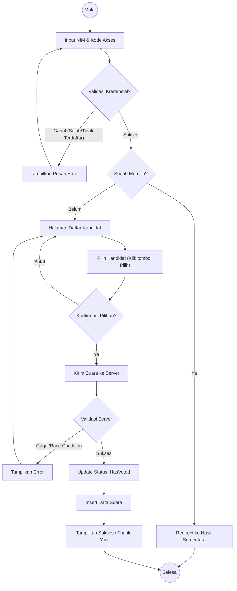
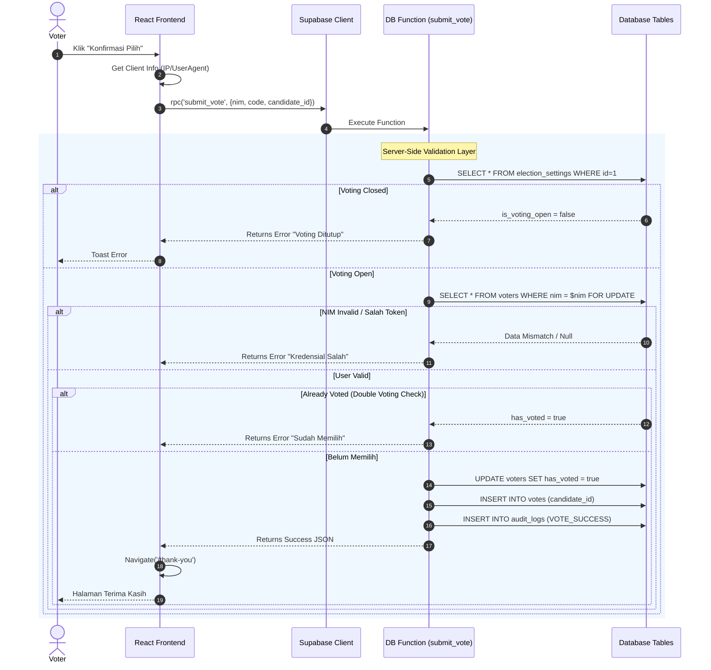
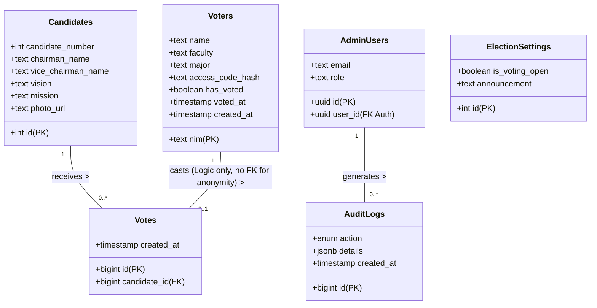

# UML Diagrams - E-Voting PEMIRA System

Dokumen ini berisi diagram perancangan sistem menggunakan notasi UML (Unified Modeling Language) dalam format Mermaid.js. Anda dapat menggunakan diagram ini untuk BAB III (Perancangan Sistem) dalam skripsi.

---

## 1. Use Case Diagram
Menggambarkan interaksi antara Aktor (Pemilih & Admin) dengan fitur-fitur sistem.

```mermaid
usecaseDiagram
    actor "Pemilih (Voter)" as Voter
    actor "Administrator" as Admin

    usecase "Login (NIM & Access Code)" as UC1
    usecase "Melihat Daftar Kandidat" as UC2
    usecase "Melakukan Voting (Coblos)" as UC3
    usecase "Melihat Hasil Sementara (Real Count)" as UC4
    
    usecase "Login Admin" as UC5
    usecase "Kelola Data Kandidat" as UC6
    usecase "Kelola Data DPT (Import CSV)" as UC7
    usecase "Monitoring Hasil & Log Audit" as UC8
    usecase "Buka/Tutup Voting" as UC9

    Voter --> UC1
    Voter --> UC2
    Voter --> UC3
    Voter --> UC4
    
    Admin --> UC5
    Admin --> UC6
    Admin --> UC7
    Admin --> UC8
    Admin --> UC9
    
    UC3 .> UC1 : include
    UC4 .> UC1 : include (optional)
    UC6 .> UC5 : include
    UC7 .> UC5 : include
    UC8 .> UC5 : include
```

---

## 2. Activity Diagram (Proses Voting)
Menggambarkan alur aktivitas pemilih mulai dari login hingga selesai memilih.



---

## 3. Sequence Diagram (Proses Submit Vote)
Menggambarkan interaksi detail antar objek/komponen saat pemilih melakukan *Submit Vote*, termasuk validasi keamanan RPC dan RLS.



---

## 4. Class Diagram (Skema Database)
Menggambarkan struktur tabel database dan relasi antar entitas.



---

## 5. Deployment Diagram (Arsitektur Sistem)
Menggambarkan arsitektur fisik deployment aplikasi di Vercel dan Supabase.

```mermaid
graph TD
    subgraph Client_Device [Perangkat Pengguna]
        Browser["Web Browser (Chrome/Safari)"]
    end

    subgraph Cloud_Infrastructure [Cloud Infrastructure]
        subgraph Vercel_Cloud [Vercel (Frontend Hosting)]
            ReactApp[React JS Application]
            CDN[CDN & Static Assets]
        end
        
        subgraph Supabase_Cloud [Supabase (Backend as a Service)]
            Postgres[PostgreSQL Database]
            Auth["Supabase Auth (JWT)"]
            Storage["Supabase Storage (Images)"]
            
            subgraph Security_Layer [Security Layer]
                RLS[Row Level Security]
                RPC["RPC Functions (Logic)"]
            end
        end
    end

    Browser -- HTTPS/TLS 1.3 --> ReactApp
    ReactApp -- REST/WebSocket (HTTPS) --> Supabase_Cloud
    
    Security_Layer -.-> Postgres
    ReactApp --> Auth
    ReactApp --> Storage
```
