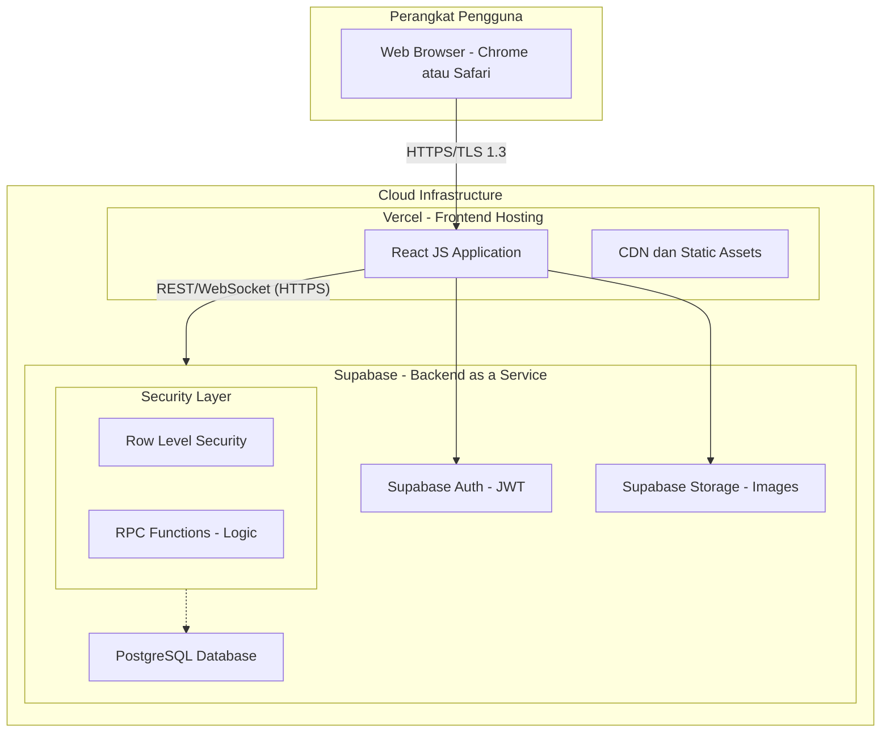

# UML Diagrams - E-Voting PEMIRA System

Dokumen ini berisi diagram perancangan sistem menggunakan notasi UML (Unified Modeling Language) dalam format Mermaid.js. Anda dapat menggunakan diagram ini untuk BAB III (Perancangan Sistem) dalam skripsi.

---

## 1. Use Case Diagram
Menggambarkan interaksi antara Aktor (Pemilih & Admin) dengan fitur-fitur sistem.

```mermaid
graph LR
    subgraph System [Sistem E-Voting BEM]
        direction TB
        UC1(Login - NIM dan Kode Akses)
        UC2(Melihat Daftar Kandidat)
        UC3(Melakukan Voting - Coblos)
        UC4(Melihat Hasil Sementara - Real Count)
        UC5(Login Admin)
        UC6(Kelola Data Kandidat)
        UC7(Kelola Data DPT - Import CSV)
        UC8(Monitoring Hasil dan Log Audit)
        UC9(Buka Tutup Voting)
    end

    Voter[👤 Pemilih - Voter]
    Admin[👤 Administrator]

    Voter --> UC1
    Voter --> UC2
    Voter --> UC3
    Voter --> UC4
    
    Admin --> UC5
    Admin --> UC6
    Admin --> UC7
    Admin --> UC8
    Admin --> UC9
    
    %% Includes (Dependencies)
    UC3 -.->|include| UC1
    UC4 -.->|include| UC1
    UC6 -.->|include| UC5
    UC7 -.->|include| UC5
    UC8 -.->|include| UC5
```

---

## 2. Activity Diagram (Proses Voting)
Menggambarkan alur aktivitas pemilih mulai dari login hingga selesai memilih.

---

## 3. Sequence Diagram (Proses Submit Vote)
Menggambarkan interaksi detail antar objek/komponen saat pemilih melakukan *Submit Vote*, termasuk validasi keamanan RPC dan RLS.

```mermaid
sequenceDiagram
    autonumber
    actor Voter
    participant Frontend as React Frontend
    participant Supabase as Supabase Client
    participant RPC as DB Function (submit_vote)
    participant Tables as Database Tables
    
    Voter->>Frontend: Klik "Konfirmasi Pilih"
    Frontend->>Frontend: Get Client Info (IP/UserAgent)
    Frontend->>Supabase: rpc('submit_vote', {nim, code, candidate_id})
    
    Supabase->>RPC: Execute Function
    
        Note over RPC: Server-Side Validation Layer
        
        RPC->>Tables: SELECT * FROM election_settings WHERE id=1
        
        alt Voting Closed
            Tables-->>RPC: is_voting_open = false
            RPC-->>Frontend: Returns Error "Voting Ditutup"
            Frontend-->>Voter: Toast Error
        else Voting Open
            
            RPC->>Tables: SELECT * FROM voters WHERE nim = $nim FOR UPDATE
            
            alt NIM Invalid / Salah Token
                Tables-->>RPC: Data Mismatch / Null
                RPC-->>Frontend: Returns Error "Kredensial Salah"
            else User Valid
                
                alt Already Voted (Double Voting Check)
                    Tables-->>RPC: has_voted = true
                    RPC-->>Frontend: Returns Error "Sudah Memilih"
                else Belum Memilih
                    
                    RPC->>Tables: UPDATE voters SET has_voted = true
                    RPC->>Tables: INSERT INTO votes (candidate_id)
                    RPC->>Tables: INSERT INTO audit_logs (VOTE_SUCCESS)
                    
                    RPC-->>Frontend: Returns Success JSON
                    Frontend->>Frontend: Navigate('/thank-you')
                    Frontend-->>Voter: Halaman Terima Kasih
                end
            end
        end

```

---

## 4. Class Diagram (Skema Database)
Menggambarkan struktur tabel database dan relasi antar entitas.

---

## 5. Deployment Diagram (Arsitektur Sistem)
Menggambarkan arsitektur fisik deployment aplikasi di Vercel dan Supabase.

