# Entity Relationship Diagram (ERD)
## Platform E-Voting PEMIRA Universitas Baturaja

### Diagram ERD (Mermaid)

```mermaid
erDiagram
    %% ============================================
    %% DECOUPLED ARCHITECTURE: 
    %% voters dan votes TIDAK memiliki relasi FK
    %% untuk menjamin ANONIMITAS TOTAL pemilih
    %% ============================================

    candidates {
        bigint id PK "GENERATED BY DEFAULT AS IDENTITY"
        int candidate_number "NOT NULL"
        text chairman_name "NOT NULL"
        text vice_chairman_name "DEFAULT ''"
        text vision "NOT NULL"
        text mission "NOT NULL"
        text photo_url "NULLABLE"
        timestamptz created_at "DEFAULT now()"
    }

    voters {
        text nim PK "NIM Mahasiswa"
        text name "NOT NULL"
        text faculty "NOT NULL, DEFAULT 'Unknown'"
        text major "NOT NULL, DEFAULT 'Unknown'"
        text access_code_hash "NOT NULL, BCrypt Hash"
        boolean has_voted "DEFAULT false"
        timestamptz voted_at "NULLABLE"
        timestamptz created_at "DEFAULT now()"
    }

    votes {
        uuid id PK "gen_random_uuid()"
        bigint candidate_id FK "NOT NULL"
    }

    vote_rate_limits {
        text client_key PK "nim:xxx atau dev:xxx"
        int fail_count "DEFAULT 0"
        timestamptz first_fail_at "NULLABLE"
        timestamptz blocked_until "NULLABLE"
        timestamptz updated_at "DEFAULT now()"
    }

    audit_logs {
        uuid id PK "gen_random_uuid()"
        log_type action "ENUM: LOGIN_FAIL, VOTE_SUCCESS, dll"
        jsonb details "NULLABLE"
        timestamptz created_at "DEFAULT now()"
    }

    election_settings {
        int id PK "DEFAULT 1, CHECK(id=1)"
        boolean is_voting_open "DEFAULT false"
        boolean show_live_result "DEFAULT false"
        timestamptz updated_at "DEFAULT now()"
    }

    admin_users {
        uuid user_id PK "FK ke auth.users"
        text role "DEFAULT 'admin'"
        timestamptz created_at "DEFAULT now()"
    }

    auth_users {
        uuid id PK "Supabase Auth"
        text email "Admin Email"
        text encrypted_password "Managed by Supabase"
    }

    %% ============================================
    %% RELASI
    %% ============================================

    votes }o--|| candidates : "candidate_id → id"
    admin_users ||--|| auth_users : "user_id → id"

    %% CATATAN PENTING:
    %% voters --|x votes : "TIDAK ADA RELASI (Decoupled)"
    %% Ini adalah desain yang disengaja untuk menjamin
    %% anonimitas total suara pemilih
```



### Keterangan Arsitektur Decoupled

```
┌─────────────────────────────────────────────────────────────────┐
│                    DECOUPLED ARCHITECTURE                         │
├─────────────────────────────────────────────────────────────────┤
│                                                                   │
│   ┌──────────────┐              ┌──────────────┐                │
│   │   VOTERS     │     ╳ ╳ ╳   │    VOTES     │                │
│   │              │   NO RELASI  │              │                │
│   │  nim (PK)    │◄────────────►│  id (PK)     │                │
│   │  name        │   (Anonymity)│  candidate_id│──┐             │
│   │  has_voted   │              │              │  │             │
│   └──────────────┘              └──────────────┘  │             │
│                                                    │             │
│                                        ┌───────────┘             │
│                                        ▼                         │
│                               ┌──────────────┐                   │
│                               │  CANDIDATES  │                   │
│                               │              │                   │
│                               │  id (PK)     │                   │
│                               │ chairman_name│                   │
│                               │  vision/misi │                   │
│                               └──────────────┘                   │
│                                                                   │
│   PRINSIP: Sistem hanya mencatat "siapa sudah memilih"           │
│   (has_voted=true) TANPA mencatat "siapa memilih siapa"          │
│   → Anonimitas TOTAL terjamin secara desain database             │
│                                                                   │
└─────────────────────────────────────────────────────────────────┘
```

### Relasi Antar Tabel

| Tabel Asal | Tabel Tujuan | Tipe Relasi | Keterangan |
|------------|--------------|-------------|------------|
| `votes` | `candidates` | Many-to-One (FK) | Setiap suara merujuk ke satu kandidat |
| `admin_users` | `auth.users` | One-to-One (FK) | Validasi hak akses admin |
| `voters` | `votes` | **TIDAK ADA** | Desain Decoupled untuk anonimitas |
| `vote_rate_limits` | `voters` | **TIDAK ADA** | Menggunakan string key (`nim:xxx`) |

### Tipe ENUM

```sql
CREATE TYPE log_type AS ENUM (
    'LOGIN_FAIL',
    'VOTE_SUCCESS', 
    'SYSTEM_ERROR',
    'ADMIN_ACTION',
    'SECURITY_ALERT'
);
```

### Catatan Teknis
1. **Tabel `votes` tidak memiliki kolom timestamp** — ini disengaja untuk mencegah korelasi temporal dengan `audit_logs` yang bisa membocorkan identitas pemilih.
2. **Tabel `election_settings` hanya 1 baris** — dijaga oleh constraint `CHECK (id = 1)`.
3. **`vote_rate_limits` menggunakan dual-key** — format `nim:<nim>` untuk rate limit per akun dan `dev:<hash>` untuk rate limit per perangkat.
4. **Seluruh tabel dilindungi RLS** — Row Level Security aktif untuk mencegah akses langsung dari client-side.
